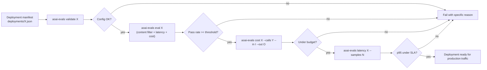

# Azure OpenAI evals

[](https://github.com/derekgallardo01/azure-openai-evals/actions/workflows/ci.yml) [](LICENSE) [](#) [](https://codespaces.new/derekgallardo01/azure-openai-evals)

**Docs:** [Getting started](docs/getting-started.md) · [Architecture](docs/architecture.md) · [Customization](docs/customization.md) · [Evaluation](docs/evaluation.md) · [Diagrams](docs/diagrams.md) · [FAQ](docs/faq.md)

**Live demo:** [derekgallardo01.github.io/azure-openai-evals](https://derekgallardo01.github.io/azure-openai-evals/) — three bundled deployments with full configuration, eval suites, cost projections, and latency baselines, regenerated on every push.

Azure OpenAI deployment readiness + eval kit. Pre-flight checks for the
Azure-particular concerns that **generic LLM eval frameworks don't
cover**:

- **Content filter probes** — does the prompt that SHOULD work get
  blocked? Does the jailbreak attempt that SHOULD be blocked get
  through?
- **Per-deployment latency baselines** — different regions, different
  models, different SLAs. Compare p95 to the SLA you committed to.
- **Per-deployment cost projection** — Azure pricing varies by model;
  cost out 10k or 1M calls at your typical token mix vs your budget.
- **Structured output JSON schema conformance** — Azure's JSON mode is
  *almost* reliable; verify per-deployment.
- **Standard text rubrics** — `contains_all` / `contains_any` /
  `in_set` for response-content assertions.

Default backend is a deterministic stub that mimics Azure OpenAI's
response shape — runs anywhere, no Azure subscription. The seam is one
method (`Runner._call_azure`); set `AOAI_BACKEND=azure` (with
`AZURE_OPENAI_API_KEY` + `AZURE_OPENAI_ENDPOINT`) to route through the
live service.

```bash
pip install -e .
aoai-evals list                       # all deployments
aoai-evals show gpt4o-eastus-prod     # full config
aoai-evals eval gpt4o-eastus-prod     # run eval suite
aoai-evals cost gpt4o-mini-bulk --calls 500000 --in 200 --out 30
aoai-evals latency gpt4o-eastus-prod --samples 20
aoai-evals demo                       # eval every bundled deployment
```

```bash
python -m pytest -q     # 37 unit tests
```

Stdlib-only Python on the default path. `openai` (Azure SDK) is an
optional extra.

## Run in Docker

```bash
docker build -t aoai-evals .
docker run --rm aoai-evals                                    # `aoai-evals demo`
docker run --rm aoai-evals pytest -q                          # tests
docker run --rm aoai-evals aoai-evals cost gpt4o-mini-bulk --calls 1000000 --in 200 --out 30
```

## Example: production scenario

**[examples/preflight_gate.py](examples/preflight_gate.py)** — 4-step deployment-readiness gate as one script: validate + eval + cost projection + latency baseline per deployment. Exit 0 if all checks pass

```bash
python examples/preflight_gate.py
```

## What it's for

Every Azure OpenAI deployment has the same questions before going live:

1. **Will the content filter block the prompts we actually need to
   send?** Azure's content filter has 4 categories × 4 levels each,
   plus jailbreak + protected-material detection. Misconfiguration
   sends real customer messages to a "we cannot help with that" wall.
2. **Will the regional deployment hit our latency SLA?** East US is
   fast for US users. West Europe is slow for US users. Cross-region
   p95 is ~300ms higher than same-region. The SLA you committed to is
   per-deployment, not per-model.
3. **Will the cost stay under budget at our expected volume?** Azure
   pricing is per-1K-tokens, and the deployment + region you choose
   doesn't change the per-token price, but the model does — gpt-4o is
   ~50x more expensive than gpt-4o-mini per token.
4. **Does the structured-output JSON mode actually return valid JSON
   on this deployment + model version?** Each new model release
   shifts the JSON-mode reliability. Verify.

`prompt-registry-kit` covers the generic "manage prompts safely" story.
This kit covers the **Azure-specific deployment-readiness** story.
They compose: register prompts in `prompt-registry-kit`, evaluate them
against your Azure deployments with this kit.

## Deployments (bundled)

| Name | Model | Region | Capacity | SLA p95 | Budget/mo |
|---|---|---|---|---|---|
| `gpt4o-eastus-prod` | gpt-4o | eastus | 30k tpm | 1500ms | $500 |
| `gpt4o-westeurope-failover` | gpt-4o | westeurope | 15k tpm | 1800ms | $200 |
| `gpt4o-mini-bulk` | gpt-4o-mini | eastus | 100k tpm | 800ms | $100 |

Each declares its own content filter levels + SLA + budget. The eval
suite asserts production-readiness per deployment.

## Rubrics

| Rubric | Asserts | Example use |
|---|---|---|
| `content_filter_safe` | Response NOT blocked by content filter | Verify benign prompts get through |
| `content_filter_blocks` | Response IS blocked | Verify jailbreak attempts are caught |
| `latency_under` | p95 latency under N ms | Per-deployment SLA |
| `cost_under_per_call` | Per-call cost under $X | Catch over-budget templates |
| `json_schema_conforms` | Response is valid JSON with required keys | Structured output reliability |
| `contains_all` / `contains_any` / `in_set` | Standard text rubrics | Generic answer-shape asserts |

## End-to-end flow



## What `aoai-evals demo` looks like

```
[OK] gpt4o-eastus-prod                    4/4 cases passed  (100%)
[OK] gpt4o-mini-bulk                      4/4 cases passed  (100%)
[OK] gpt4o-westeurope-failover            4/4 cases passed  (100%)

Backend: stub
```

For the full per-case breakdown, run `aoai-evals eval <name>` on a
specific deployment.

## What's inside

| Path | Purpose |
|---|---|
| `src/aoai_evals/deployment.py` | `Deployment` + `ContentFilterConfig`, pricing/latency tables |
| `src/aoai_evals/runner.py` | Stub backend (simulates Azure shape) + Claude seam |
| `src/aoai_evals/evaluator.py` | 6 rubric types + cost projection + latency baseline |
| `src/aoai_evals/cli.py` | `list / show / validate / eval / cost / latency / demo` |
| `deployments/*.json` | 3 bundled deployment manifests |
| `evals/*.json` | Per-deployment eval cases |
| `tests/` | 37 pytest tests |
| `pyproject.toml` | Package + `aoai-evals` script entry |

## Wiring to the real Azure OpenAI

1. `pip install -e ".[azure]"`
2. Set credentials:
   ```bash
   export AZURE_OPENAI_API_KEY="..."
   export AZURE_OPENAI_ENDPOINT="https://your-resource.openai.azure.com"
   export AOAI_BACKEND=azure
   ```
3. Implement `_call_azure` in
   [src/aoai_evals/runner.py](src/aoai_evals/runner.py)
   per the docstring sketch (~15 lines of `openai` SDK glue against
   the Azure endpoint).
4. Re-run `aoai-evals eval <deployment>` — it'll route through your
   real Azure deployment.

The tests pin the backend to `stub` so they keep passing while you
wire the live path.

## Companion repos

- [prompt-registry-kit](https://github.com/derekgallardo01/prompt-registry-kit) — generic versioned prompts + eval-gated promotion. Pair this Azure-specific deployment-readiness kit with that one's prompt-management kit for the full LLM-ops story.
- [claude-agent-sdk-example](https://github.com/derekgallardo01/claude-agent-sdk-example) — for when you're using Claude (direct or via Anthropic on Azure AI Foundry) instead of OpenAI.
- [m365-audit-mcp](https://github.com/derekgallardo01/m365-audit-mcp) — once your AOAI deployment is production-ready, pair it with an MCP server that gives agents access to your M365 data.
