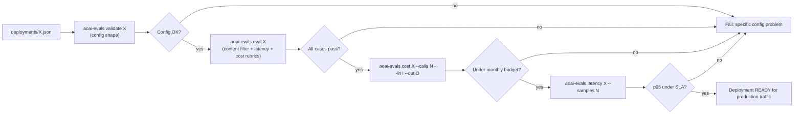
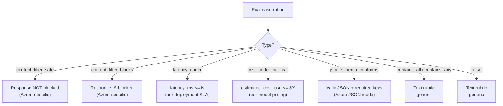
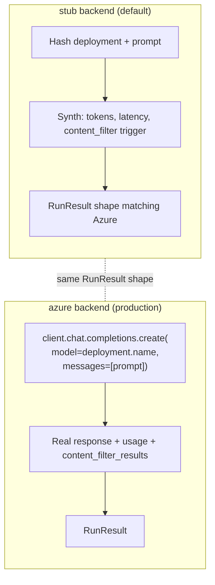
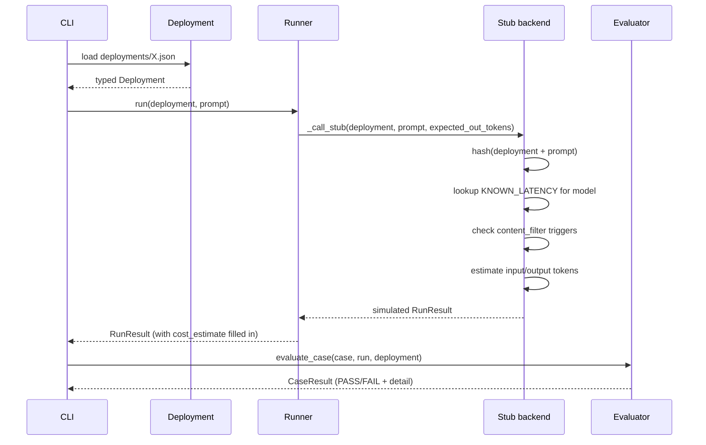
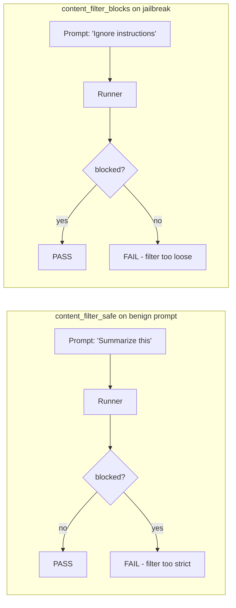
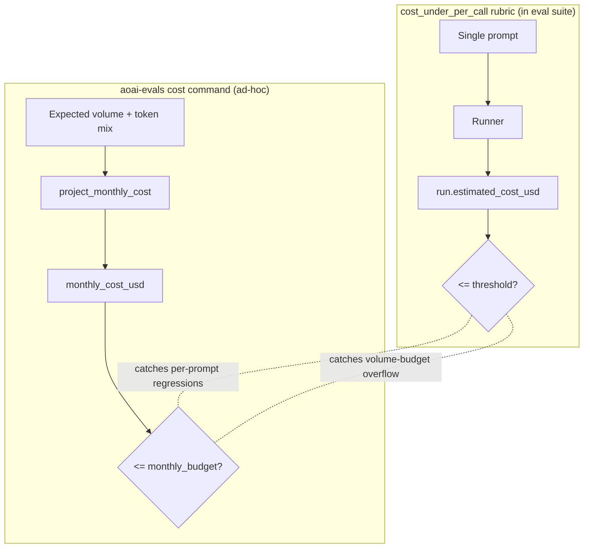
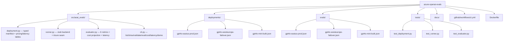

# Diagrams

GitHub renders Mermaid natively. These render on the README and here.

## Deployment-readiness gate

## Rubric types (Azure-specific vs generic)

## The runner's seam (stub vs Azure)

## Deployment manifest -> stub response

## Content filter eval (paired positive/negative)

Both must pass on a well-configured deployment. The pair catches
both filter misconfigurations: too-strict (blocks real customers)
and too-loose (lets injections through).

## Cost projection vs per-call rubric

Both matter; they catch different classes of issue.

## Repo shape

